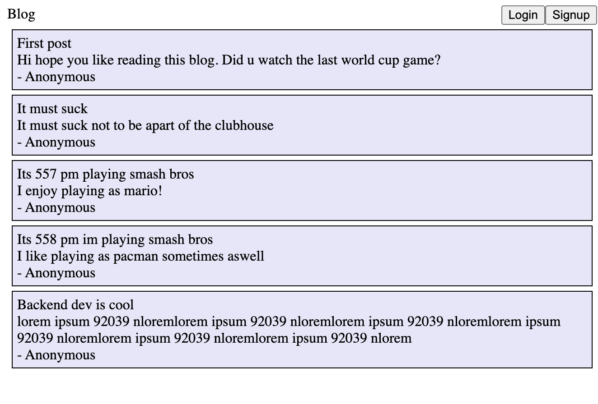
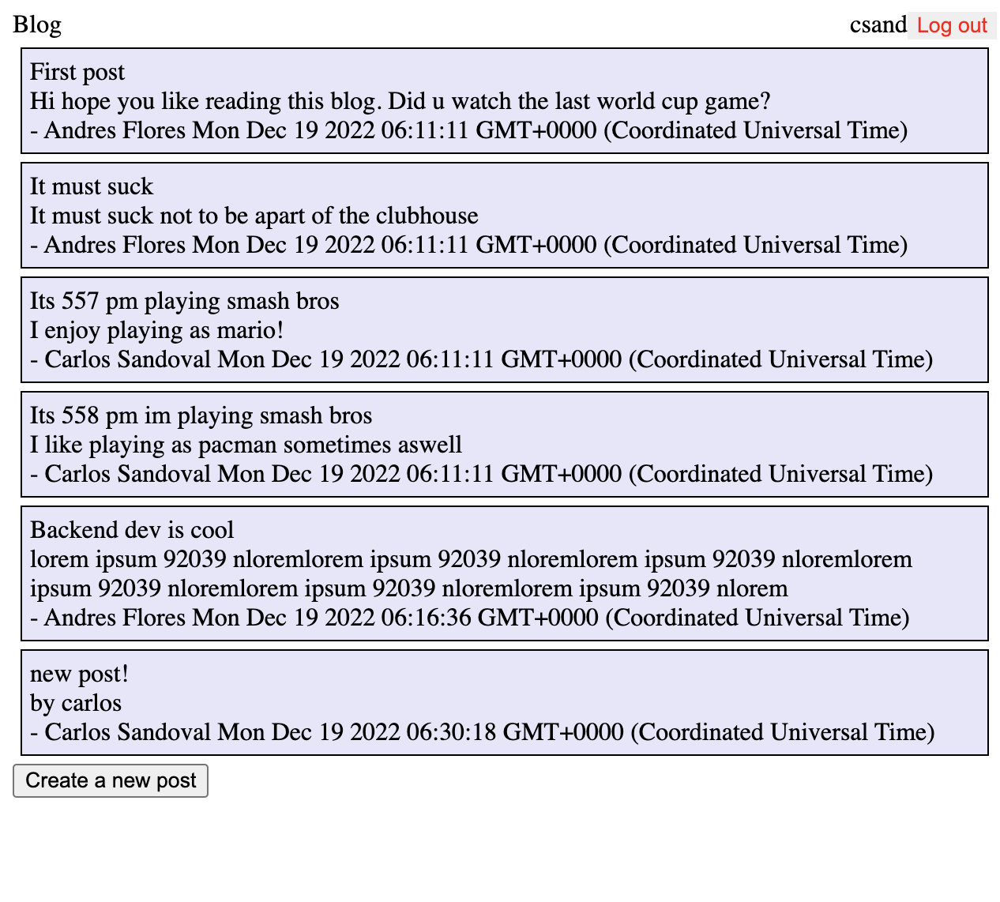
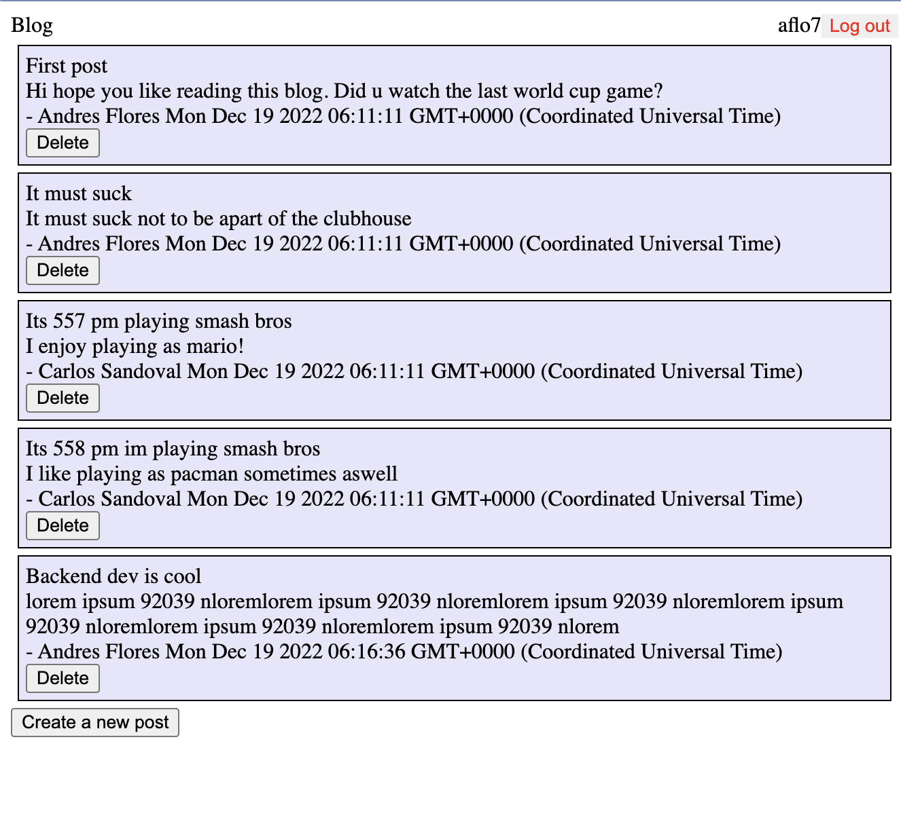

Project info
- this website is a small blog, where different users have different privileges

guest users can:
- view all posts (w/ no timestamp or author info)

logged in users (members) without admin privileges can:
- see all posts with author info and timestamp info
- create posts

logged in users with admin privileges can:
- delete posts
- create posts

To get admin privileges, a user can enter a secret key at signup

With this mini project, I learned how to:
- login a user (authenticate/validate using passportjs)
- register a user
- log out a user
- protect resources so that only valid users can see
- persist a login session as long as Node.js server is running
- use EJS templates
- deploy a project on the web

Live demo: https://app2.memberssonly.xyz/

Domain registrar used: Epik

Hosted using a digital ocean droplet (ubuntu server in the cloud)